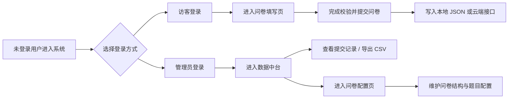

# 智能问卷与数据中台系统

面向产学研协同场景的智能问卷系统复现项目，覆盖问卷配置、在线填写、登录分流、数据提交、后台管理、CSV 导出，以及规则版 AI 问卷生成与质量检查等能力。

当前版本重点展示一套完整的前后端闭环：

- 未登录状态进入极简登录页
- 访客可直接进入问卷填写流程
- 管理员可登录进入数据中台与问卷配置页
- 问卷提交可落到本地 JSON 或云端接口
- 后台支持查看提交记录、导出 CSV、维护问卷配置

## 系统流程



## 页面预览建议

如果你准备继续完善 GitHub 仓库展示，建议在 README 中补充以下截图：

- 登录页：展示“访客登录 / 管理员登录”双入口
- 问卷填写页：展示分页问卷、进度条和智能检查面板
- 数据中台：展示提交统计、表格记录和自动洞察
- 问卷配置页：展示规则版 AI 助手和问卷编辑器

## 在线体验

- 系统首页：<https://dev-cli-d2gckev9h4548a1a5-1314995236.tcloudbaseapp.com>

说明：

- 系统首页已集成登录分流，进入后可选择“访客登录”或“管理员登录”
- 管理员能力依赖管理员令牌 / 管理员密码校验
- 公开仓库不会提交管理员凭据、云账号密钥或本地数据文件

## 当前版本特性

- 双模式登录入口：未登录时隐藏后台导航，展示全屏居中的极简登录页
- 访客登录：无需复杂注册，可直接进入问卷填写流程
- 管理员登录：输入管理员账号/密码后进入数据中台与问卷配置
- 动态问卷渲染：通过 JSON 配置渲染分页、题型、选项和字段映射
- 多题型支持：文本、长文本、单选、多选、评分、100 分权重分配
- 填写质量控制：必填校验、权重合计校验、整页核对、提交前检查
- 问卷编辑器：支持维护标题、说明、分页、题目、题型、选项并保存配置
- 规则版 AI 助手：根据调研目标生成问卷草案，并对当前问卷做质量检查
- 数据中台：展示提交量、平均完成度、风险提示、提交明细与自动洞察
- CSV 导出：支持按字段映射导出问卷提交记录
- 本地 / 云端双模式：可使用 `localStorage` / JSON 文件 fallback，也可接入 CloudBase

## 登录与权限说明

系统当前包含两种进入方式：

### 1. 访客登录

- 面向普通填答者
- 进入后可直接填写问卷
- 不显示左侧后台导航与数据管理能力

### 2. 管理员登录

- 面向问卷维护者与后台查看者
- 登录后可访问“数据中台”和“问卷配置”
- 后台接口依赖管理员权限校验

当前实现中，管理员密码本质上复用了现有的管理员令牌机制；如果后续需要更正式的账号体系，可以再单独扩展登录接口。

## 技术结构

```text
浏览器前端
  ├─ 极简登录页（访客 / 管理员）
  ├─ 动态问卷渲染
  ├─ 后台问卷编辑器
  ├─ 规则版 AI 生成与质量检查
  └─ 数据看板与 CSV 导出

本地 Node 服务
  ├─ server.mjs
  ├─ data/submissions.json
  └─ data/questionnaire.json

CloudBase
  ├─ 静态网站托管
  ├─ 云函数 submissions
  └─ 云数据库集合
     ├─ survey_submissions
     └─ survey_questionnaires
```

## 项目结构

```text
.
├─ app.js                         # 前端交互、登录流转、问卷渲染、后台逻辑
├─ index.html                     # 页面结构
├─ styles.css                     # 页面样式
├─ server.mjs                     # 本地 API 服务
├─ config.js                      # 前端 API 地址配置（公开版本不写敏感信息）
├─ config.example.js              # 配置示例
├─ cloudbaserc.example.json       # CloudBase 配置示例
├─ cloudfunctions/submissions     # CloudBase 云函数
├─ shared                         # 前后端共享问卷与校验逻辑
├─ scripts                        # 打包、同步、部署脚本
└─ docs                           # 开发计划与部署说明
```

## 本地运行

安装依赖：

```bash
npm install
```

启动本地服务：

```bash
npm run dev
```

默认访问：

```text
http://localhost:4173
```

如果端口被占用，可指定端口：

```powershell
$env:PORT=5173
npm run dev
```

## 常用命令

```bash
npm run check
npm run build:deploy
npm run sync:cloudfunction
```

## API 概览

```http
GET  /api/questionnaire
PUT  /api/questionnaire
GET  /api/submissions
POST /api/submissions
POST /api/demo/reset
```

其中以下接口属于管理员能力，需要管理员权限：

- `PUT /api/questionnaire`
- `GET /api/submissions`
- `POST /api/demo/reset`

## CloudBase 部署

1. 复制配置示例

```bash
copy cloudbaserc.example.json cloudbaserc.json
```

2. 修改 `cloudbaserc.json`

```json
{
  "envId": "your-cloudbase-env-id",
  "functions": [
    {
      "name": "submissions",
      "envVariables": {
        "SUBMISSIONS_COLLECTION": "survey_submissions",
        "QUESTIONNAIRE_COLLECTION": "survey_questionnaires",
        "ADMIN_TOKEN": "replace-with-a-random-admin-token"
      }
    }
  ]
}
```

3. 修改生产环境前端配置

```js
window.SMART_SURVEY_API_BASE = "https://your-cloudbase-service-domain";
window.SMART_SURVEY_ADMIN_TOKEN = "";
```

4. 打包并部署

```bash
npm run build:deploy
npm run deploy:cloudbase
```

更多细节见 [docs/cloudbase-deploy.md](docs/cloudbase-deploy.md)。

## GitHub 展示建议

建议提交到公开仓库的内容：

- `index.html`
- `app.js`
- `styles.css`
- `server.mjs`
- `cloudfunctions/submissions`
- `shared`
- `docs`
- `scripts`
- `config.example.js`
- `cloudbaserc.example.json`

不建议提交的内容：

- `cloudbaserc.json`
- `.env` / `.env.*`
- `node_modules`
- `dist`
- `output`
- `data/submissions.json`
- `data/questionnaire.json`

## 后续优化方向

- 将访客昵称 / 手机号正式写入答卷提交链路
- 将管理员登录升级为独立后端登录接口，而不是直接复用管理员令牌
- 增加更完整的角色权限体系，区分管理员、运营人员、普通填答者
- 增加问卷版本管理，支持历史版本回滚和多版本实验
- 接入真实大模型 API，实现更强的问卷生成、开放题归因与数据分析
- 接入更完整的数据分析看板或 BI 系统
